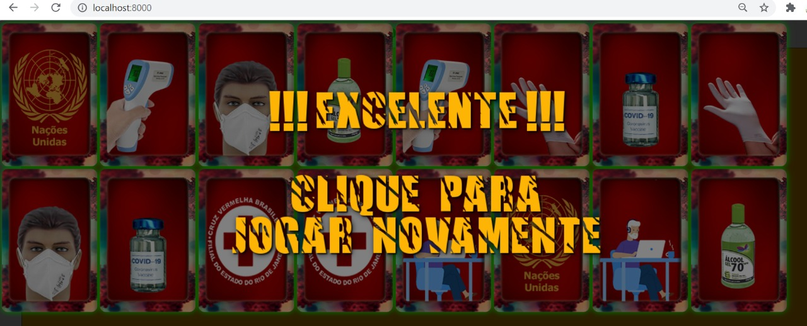

<!-- PROJECT LOGO -->
 

  

  <h3 align="center">Pandemic Memory Game</h3>

<!-- TABLE OF CONTENTS -->

  
Table of Contents

  <ol>
    <li>
      <a href="#about-the-project">About The Project</a>
	  <li><a href="#version">Version</a></li>
    <li><a href="#specialthanks">special thanks</a></li>
    <li><a href="#license">License</a></li>
    <li><a href="#contact">Contact</a></li>
 
  </ol>

<!-- ABOUT THE PROJECT -->
## About The Project

TThis academic project aims to create a memory game about a pandemic, using resources aimed at web development.

<!-- Version -->
## version

unfinished project, version 0.1

<!-- USAGE EXAMPLES -->
## specialthanks

I thank my teacher Denilson Rodrigues da Silva for teaching me to program

<!-- LICENSE -->
## License

Distributed under the Free License. See `LICENSE` for more information.

<!-- CONTACT -->
## Contact

linkedin - https://www.linkedin.com/in/samuel-krieger-bonini-80a169166/